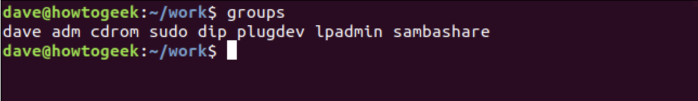

<!-- BASIC EXPLANATION OF SOFTWARE DEVELOPMENT LIFE CYCLE (SDLC) -->

# What is SDLC?

SDLC stands for Software Development Life Cycle, which is a process that outlines the steps involved in creating software from conception to deployment. The process is designed to ensure that the software is developed according to the specific requirements and that the final product is of high quality. The main steps involved in the SDLC are:

1. Requirements gathering and analysis: This involves understanding the needs of the customers and stakeholders, and determining the requirements for the software.

2. Design: In this phase, the software architecture and design are developed, including the selection of the appropriate technology and tools.

3. Implementation: This is the actual coding and development of the software, where the design is turned into a working product.

4. Testing: In this phase, the software is thoroughly tested to ensure that it meets the specified requirements and works as expected.

5. Deployment: After the software has been thoroughly tested, it is deployed to the production environment and made available to the end-users.

6. Maintenance: This is an ongoing process that involves fixing bugs, making improvements, and updating the software to keep it current and functional.

The SDLC provides a structured approach to software development and helps to ensure that the software is delivered on time, within budget, and to the required quality.

---

<!-- BASIC EXPLANATION OF LAMP -->

# What is LAMP?

LAMP is an acronym that stands for Linux, Apache, MySQL, and PHP. It refers to a software stack that is used to build dynamic websites and web applications. The components of the LAMP stack are:

1. Linux: A free and open-source operating system that is the foundation of the LAMP stack.

2. Apache: An open-source web server software that is used to serve web pages and run web applications.

3. MySQL: A popular open-source relational database management system used to store and manage data for websites and web applications.

4. PHP: A server-side scripting language used to build dynamic websites and web applications. It is used to write scripts that interact with databases, generate HTML pages, and perform other tasks.

Together, these components form a complete solution for building and running web applications. The LAMP stack is popular because it is open-source, flexible, and provides a cost-effective solution for small and medium-sized businesses. It is also scalable, meaning that it can grow with a business's needs.

--- 

<!-- BASIC EXPLANATION OF CHMOD -->

# What is chmod?

Check source [here](https://www.howtogeek.com/437958/how-to-use-the-chmod-command-on-linux/)

chmod is a command in Unix-like operating systems that stands for "change mode" and is used to change the permissions on a file or directory. Permissions determine which users have access to read, write, or execute a file or directory.

## Key Take Away

Chmod takes three main arguments: `r`, `w`, and `x`, which stand for read, write, and execute, respectively. Adding or removing combinations of the arguments controls file and folder permissions. For example, `chmod +rwx` adds permission to read, write, and execute scripts. Running `chmod -wx` removes the ability to write and execute.

## chmod Modifies File Permissions

In Linux, who can do what to a file or directory is controlled through sets of permissions. There are three sets of permissions. One set for the owner of the file, another set for the members of the file’s group, and a final set for everyone else.

The permissions control the actions that can be performed on the file or directory. They either permit, or prevent, a file from being read, modified or, if it is a script or program, executed. For a directory, the permissions govern who can cd into the directory and who can create, or modify files within the directory.

## Viewing and Understanding File Permissions

We can use the `-l` (long format) option to have `ls` list the file permissions for files and directories.

`Bash`

    ls -l

On each line, the first character identifies the type of entry that is being listed. If it is a dash `-` it is a file. If it is the letter `d` it is a directory.

The next nine characters represent the settings for the three sets of permissions.

* The first three characters show the permissions for the user who owns the file (user permissions).

* The middle three characters show the permissions for members of the file’s group (group permissions).

* The last three characters show the permissions for anyone not in the first two categories (other permissions).

There are three characters in each set of permissions. The characters are indicators for the presence or absence of one of the permissions. They are either a dash `-` or a letter. If the character is a dash, it means that permission is not granted. If the character is an `r`, `w`, or an `x`, that permission has been granted.

The letters represent:

* `r` Read permissions. The file can be opened, and its content viewed.

* `w` Write permissions. The file can be edited, modified, and deleted.

* `x` Execute permissions. If the file is a script or a program, it can be run (executed).

For example:

* --- means no permissions have been granted at all.

* `r` `w` `x` means full permissions have been granted. The read, write, and execute indicators are all present.

In our screenshot, the first line starts with a `d`. This line refers to a directory called “archive.” The owner of the directory is “dave,” and the name of the group that the directory belongs to is also called “dave.”

The next three characters are the user permissions for this directory. These show that the owner has full permissions. The `r`, `w`, and `x` characters are all present. This means the user dave has read, write and execute permissions for that directory.

The second set of three characters are the group permissions, these are `r` `-` `x`. These show that the members of the dave group have read and execute permissions for this directory. That means they can list the files and their contents in the directory, and they can cd (execute) into that directory. They do not have write permissions, so they cannot create, edit, or delete files.

The final set of three characters are also `r` `-` `x`.  These permissions apply to people who are not governed by the first two sets of permissions. These people (called”others”) have read and execute permissions on this directory.

So, to summarise, group members and others have read and execute permissions. The owner, a user called dave, also has write permissions.

For all of the other files (apart from the `mh.sh` script file) dave and members of the dave group have read and write properties on the files, and the others have read permissions only.

For the special case of the mh.sh script file, the owner dave and the group members have read, write, and execute permissions, and the others have read and execute permissions only.

## Understanding The Permission Syntax

To use chmod to set permissions, we need to tell it:

* Who: Who we are setting permissions for.

* What: What change are we making? Are we adding or removing the permission?

* Which: Which of the permissions are we setting?

We use indicators to represent these values, and form short “permissions statements” such as `u` `+` `x`, where `u` means ”user” (who), `+` means add (what), and `x` means the execute permission (which).

The “who” values we can use are:

* `u` User, meaning the owner of the file.

* `g` Group, meaning members of the group the file belongs to.

* `o` Others, meaning people not governed by the u and g permissions.

* `a` All, meaning all of the above.

If none of these are used, chmod behaves as if `a` had been used.

The “what” values we can use are:

* `–` Minus sign. Removes the permission.

* `+` Plus sign. Grants the permission. The permission is added to the existing permissions. If you want to have this permission and only this permission set, use the `=` option, described below.

* `=` Equals sign. Set a permission and remove others.

The “which ” values we can use are:

* `r`  The read permission.

* `w` The write permission.

* `x` The execute permission.

## Setting And Modifying Permissions

Let’s say we have a file where everyone has full permissions on it.

`Bash`

    ls -l new_ file.txt

   

    

We want the user dave to have read and write permissions and the group and other users to have read permissions only. We can do using the following command:

`Bash`

    chmod u=rw,og=r new_file.txt

Using the `=` operator means we wipe out any existing permissions and then set the ones specified.

let’s check the new permission on this file:

`Bash`

    ls -l new_file.txt

The existing permissions have been removed, and the new permissions have been set, as we expected.

How about adding a permission without removing the existing permissions settings? We can do that easily too.

Let’s say we have a script file that we have finished editing. We need to make it executable for all users. Its current permissions look like this:

`Bash`

    ls -l new_script.sh

We can add the execute permission for everyone with the following command:

`Bash`

    chmod a+x new_script.sh

    

If we take a look at the permissions, we’ll see that the execute permission is now granted to everyone, and the existing permissions are still in place.

`Bash`

    ls -l new_script.sh

We could have achieved the same thing without the `a` in the `a` `+` `x` statement. The following command below would have worked just as well.

`Bash`

    chmod +x new_script.sh

## Setting Permissions for Multiple Files

We can apply permissions to multiple files all at once.

These are the files in the current directory:

`Bash`

    ls -l

Let’s say we want to remove the read permissions for the “other” users from files that have a “.page” extension. We can do this with the following command:

`Bash`

    chmod o-r *.page

Let’s check what effect that has had:

`Bash`

    ls -l

As we can see, the read permission has been removed from the “.page” files for the “other” category of users. No other files have been affected.

If we had wanted to include files in subdirectories, we could have used the `-R` (recursive) option.

`Bash`

    chmod -R o-r *.page

## Numerical Shorthand

Another way to use chmod is to provide the permissions you wish to give to the owner, group, and others as a three-digit number. The leftmost digit represents the permissions for the owner. The middle digit represents the permissions for the group members. The rightmost digit represents the permissions for the others.

The digits you can use and what they represent are listed here:

* `0` (000) No permission.

* `1` (001) Execute permission.

* `2` (010) Write permission.

* `3` (011) Write and execute permissions.

* `4` (100) Read permission.

* `5` (101) Read and execute permissions.

* `6` (110) Read and write permissions.

* `7` (111) Read, write, and execute permissions.

Each of the three permissions is represented by one of the bits in the binary equivalent of the decimal number. So `5`, which is 101 in binary, means read and execute. `2`, which is 010 in binary, would mean the write permission.

Using this method, you set the permissions that you wish to have; you do not add these permissions to the existing permissions. So if read and write permissions were already in place you would have to use `7` (111) to add execute permissions. Using `1` (001) would remove the read and write permissions and add the execute permission.

Let’s add the read permission back on the “.page” files for the others category of users. We must set the user and group permissions as well, so we need to set them to what they are already. These users already have read and write permissions, which is `6` (110). We want the “others” to have read and permissions, so they need to be set to `4` (100).

The following command will accomplish this:

`Bash`

    chmod 664 *.page

This sets the permissions we require for the user, group members, and others to what we require. The users and group members have their permissions reset to what they already were, and the others have the read permission restored.

`Bash`
  
    ls -l

---

<!-- BASIC EXPLANATION OF CHOWN -->

# What is CHOWN?

"chown" stands for "change owner" and it's a command in Unix-like operating systems that allows a user to change the owner of a file or directory. The owner of a file or directory has certain privileges over it, such as the ability to read, write, and execute the file.

## Each File Belongs to a User and a Group

Linux is a multi-user system. The operating system allows multiple user accounts to be defined and for any valid user to log on to the computer. Moreover, multiple users can use a single computer at the same time.

To maintain a record of which files belong to which user and to enforce some security, Linux uses the concept of ownership. Every file belongs to an owner—a user—and to a group.

When a file is created, its owner is the user who created it. The group that the file belongs to—the “owning” group—is the user’s current group. Users and groups have names, and they have numeric identities too, called a user (or unique) identifier (UID) and a group identifier (GID).

When you create a file, it is owned by you, and it belongs to your current group. Usually, this is the group you have signed into. By default, this is a group that shares the same name as your user name and was created when you were created as a user on the system.

You can use the chown command to can change the ownership values to something else. You can set a new owner, a new group, or a new owner and a new group at the same time. The owner of a file can change the group ownership, but only root can change the user ownership because that involves another user. Without root privileges, you can’t make another user on the system unwittingly “adopt” a file.

## Why Would You Want To Change Ownership?

Here are a few examples of situations where you might want to do this:

* If you transfer files between different Linux or Unix-like operating systems, you will need to change the user and group owners to the new user and group owners of the account you wish to use the files under on the new Linux computer.

* A user may leave your organization, and all of his files will be the responsibility of another staff member. You will need to change the owner and group owner to the staff member now responsible for those files.

* You may author a script that is going to be used by a specific user.
You may create a file or directory logged in as root, but you want it to be accessible to a specific user.

## Viewing Your Groups, UID, and GID

To list the groups you are in, you can use the groups command.

`Bash`

    groups

    

