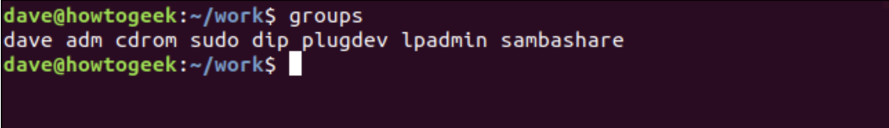
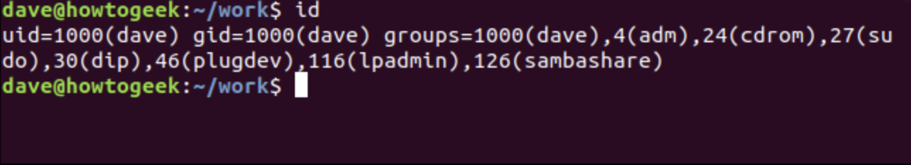
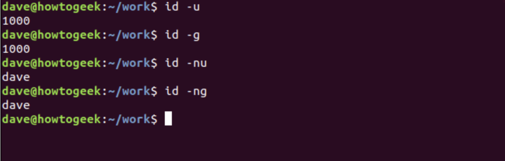
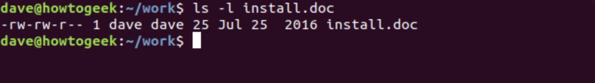
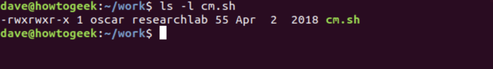
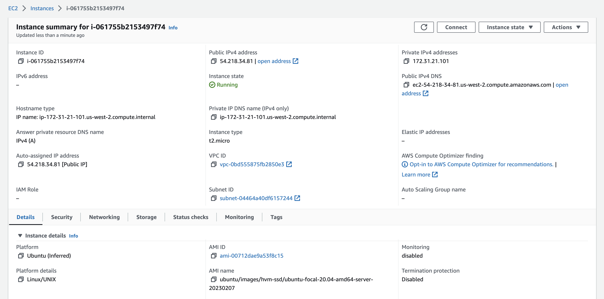

# PROJECT 1 - WEB STACK IMPLEMENTATION (LAMP STACK) IN AWS. The LAMP (Linux, Apache, MySQL, PHP/Perl/Python) is an acronym denoting one of the most common software stacks for many of the web's most popular applications. 

## SIDE SELF STUDY:

<!-- BASIC EXPLANATION OF SOFTWARE DEVELOPMENT LIFE CYCLE (SDLC) -->

# What is SDLC?

SDLC stands for Software Development Life Cycle, which is a process that outlines the steps involved in creating software from conception to deployment. The process is designed to ensure that the software is developed according to the specific requirements and that the final product is of high quality. The main steps involved in the SDLC are:

1. Requirements gathering and analysis: This involves understanding the needs of the customers and stakeholders, and determining the requirements for the software.

2. Design: In this phase, the software architecture and design are developed, including the selection of the appropriate technology and tools.

3. Implementation: This is the actual coding and development of the software, where the design is turned into a working product.

4. Testing: In this phase, the software is thoroughly tested to ensure that it meets the specified requirements and works as expected.

5. Deployment: After the software has been thoroughly tested, it is deployed to the production environment and made available to the end-users.

6. Maintenance: This is an ongoing process that involves fixing bugs, making improvements, and updating the software to keep it current and functional.

The SDLC provides a structured approach to software development and helps to ensure that the software is delivered on time, within budget, and to the required quality.

---

<!-- BASIC EXPLANATION OF LAMP -->

# What is LAMP?

LAMP is an acronym that stands for Linux, Apache, MySQL, and PHP/Perl/Python. It refers to a software stack that is used to build dynamic websites and web applications. The architecture of the components of the LAMP stack are:

1. Operating system  

   **Linux** is the operating system (OS) and foundation of the LAMP stack. Launched in 1991, Linux is a free and open source OS that enjoys extensive popularity worldwide. It’s flexible and customizable, as it is open source, giving organizations the ability to modify the source code to fit their needs. The other three pieces of the LAMP stack sit atop the Linux OS.

2. Web server  
   **Apache**: Apache HTTP Server is a web server software that delivers web content though the internet. Launched in 1995, Apache has grown to be one of the most popular web servers in the world. As the second layer in the LAMP stack, Apache processes client requests over the internet. Using Hypertext Transfer Protocol (HTTP) it accepts incoming HTTP requests and then serves the relevant web content. Since Apache is open source, this strong ecosystem has built many modules that extend the functionality of Apache. These modules can include authentication, encryption, diagnostics, logging, and more. 

3. Database  
   **MySQL** is an open source relational database for storing application data. Launched in 1996, MySQL is now the second most popular database in the world, according to DB-Engines. The LAMP stack uses MySQL to store, manage, and query information in the database. Information can include user accounts, user details, product names, customer records, sales, applications, and more. Using Structured Query Language (SQL), users can easily access and manipulate information stored in the database.


4. Programming language  
   Originally, the **“P”** in LAMP was used to refer to **PHP**, a programming language launched in 1995 that helps you create dynamic web pages. Over time, the **“P”** has been expanded to include **non-PHP** languages like **Python** and **Perl** that have also become more popular for web development.

   Websites today require dynamic capabilities to display real-time or updated information. Since HTML cannot perform dynamic processes, you can embed PHP, Perl, or Python code into the parts of the website that require this capability. HTML can be used for the layout of the website, while PHP, Perl, or Python is used for obtaining real-time information, such as checking the latest inventory on an e-commerce website.
---
## How it works  
You will find a simplified workflow below for a user searching for “baseball scores” on a dynamic website running the LAMP stack. Each of the layers is running on Linux as the foundational element of the stack.

Together, these components form a complete solution for building and running web applications. The LAMP stack is popular because it is open-source, flexible, and provides a cost-effective solution for small and medium-sized businesses. It is also scalable, meaning that it can grow with a business's needs.

# What is LAMP?

--- 

<!-- BASIC EXPLANATION OF CHMOD -->

# What is CHMOD?

Check source [here](https://www.howtogeek.com/437958/how-to-use-the-chmod-command-on-linux/)

chmod is a command in Unix-like operating systems that stands for "change mode" and is used to change the permissions on a file or directory. Permissions determine which users have access to read, write, or execute a file or directory.

## Key Take Away

Chmod takes three main arguments: `r`, `w`, and `x`, which stand for read, write, and execute, respectively. Adding or removing combinations of the arguments controls file and folder permissions. For example, `chmod +rwx` adds permission to read, write, and execute scripts or programs. Running `chmod -wx` removes the ability to write and execute.

## chmod Modifies File Permissions

In Linux, who can do what to a file or directory is controlled through sets of permissions. There are three sets of permissions. One set for the owner of the file, another set for the members of the file’s group, and a final set for everyone else.

The permissions control the actions that can be performed on the file or directory. They either permit, or prevent, a file from being read, modified or, if it is a script or program, executed. For a directory, the permissions govern who can cd into the directory and who can create, or modify files within the directory.

## Viewing and Understanding File Permissions

We can use the `-l` (long format) option to have `ls` list the file permissions for files and directories.

`Bash`

    ls -l


On each line, the first character identifies the type of entry that is being listed. If it is a dash `-` it is a file. If it is the letter `d` it is a directory.

The next nine characters represent the settings for the three sets of permissions.

* The first three characters show the permissions for the user who owns the file (user permissions).

* The middle three characters show the permissions for members of the file’s group (group permissions).

* The last three characters show the permissions for anyone not in the first two categories (other permissions).

There are three characters in each set of permissions. The characters are indicators for the presence or absence of one of the permissions. They are either a dash `-` or a letter. If the character is a dash, it means that permission is not granted. If the character is an `r`, `w`, or an `x`, that permission has been granted.

The letters represent:

* `r` Read permissions. The file can be opened, and its content viewed.

* `w` Write permissions. The file can be edited, modified, and deleted.

* `x` Execute permissions. If the file is a script or a program, it can be run (executed).

For example:

* --- means no permissions have been granted at all.

* `r` `w` `x` means full permissions have been granted. The read, write, and execute indicators are all present.

In our screenshot, the first line starts with a `d`. This line refers to a directory called “archive.” The owner of the directory is “dave,” and the name of the group that the directory belongs to is also called “dave.”

The next three characters are the user permissions for this directory. These show that the owner has full permissions. The `r`, `w`, and `x` characters are all present. This means the user dave has read, write and execute permissions for that directory.

The second set of three characters are the group permissions, these are `r` `-` `x`. These show that the members of the dave group have read and execute permissions for this directory. That means they can list the files and their contents in the directory, and they can cd (execute) into that directory. They do not have write permissions, so they cannot create, edit, or delete files.

The final set of three characters are also `r` `-` `x`.  These permissions apply to people who are not governed by the first two sets of permissions. These people (called”others”) have read and execute permissions on this directory.

So, to summarise, group members and others have read and execute permissions. The owner, a user called dave, also has write permissions.

For all of the other files (apart from the `mh.sh` script file) dave and members of the dave group have read and write properties on the files, and the others have read permissions only.

For the special case of the mh.sh script file, the owner dave and the group members have read, write, and execute permissions, and the others have read and execute permissions only.

## Understanding The Permission Syntax

To use chmod to set permissions, we need to tell it:

* Who: Who we are setting permissions for.

* What: What change are we making? Are we adding or removing the permission?

* Which: Which of the permissions are we setting?

We use indicators to represent these values, and form short “permissions statements” such as `u` `+` `x`, where `u` means ”user” (who), `+` means add (what), and `x` means the execute permission (which).

The “who” values we can use are:

* `u` User, meaning the owner of the file.

* `g` Group, meaning members of the group the file belongs to.

* `o` Others, meaning people not governed by the u and g permissions.

* `a` All, meaning all of the above.

If none of these are used, chmod behaves as if `a` had been used.

The “what” values we can use are:

* `–` Minus sign. Removes the permission.

* `+` Plus sign. Grants the permission. The permission is added to the existing permissions. If you want to have this permission and only this permission set, use the `=` option, described below.

* `=` Equals sign. Set a permission and remove others.

The “which ” values we can use are:

* `r`  The read permission.

* `w` The write permission.

* `x` The execute permission.

## Setting And Modifying Permissions

Let’s say we have a file where everyone has full permissions on it.

`Bash`

    ls -l new_ file.txt

   


We want the user dave to have read and write permissions and the group and other users to have read permissions only. We can do using the following command:

`Bash`

    chmod u=rw,og=r new_file.txt


Using the `=` operator means we wipe out any existing permissions and then set the ones specified.

let’s check the new permission on this file:

`Bash`

    ls -l new_file.txt


The existing permissions have been removed, and the new permissions have been set, as we expected.

How about adding a permission without removing the existing permissions settings? We can do that easily too.

Let’s say we have a script file that we have finished editing. We need to make it executable for all users. Its current permissions look like this:

`Bash`

    ls -l new_script.sh


We can add the execute permission for everyone with the following command:

`Bash`

    chmod a+x new_script.sh

    

If we take a look at the permissions, we’ll see that the execute permission is now granted to everyone, and the existing permissions are still in place.

`Bash`

    ls -l new_script.sh


We could have achieved the same thing without the `a` in the `a` `+` `x` statement. The following command below would have worked just as well.

`Bash`

    chmod +x new_script.sh

## Setting Permissions for Multiple Files

We can apply permissions to multiple files all at once.

These are the files in the current directory:

`Bash`

    ls -l


Let’s say we want to remove the read permissions for the “other” users from files that have a “.page” extension. We can do this with the following command:

`Bash`

    chmod o-r *.page


Let’s check what effect that has had:

`Bash`

    ls -l


As we can see, the read permission has been removed from the “.page” files for the “other” category of users. No other files have been affected.

If we had wanted to include files in subdirectories, we could have used the `-R` (recursive) option.

`Bash`

    chmod -R o-r *.page

## Numerical Shorthand

Another way to use chmod is to provide the permissions you wish to give to the owner, group, and others as a three-digit number. The leftmost digit represents the permissions for the owner. The middle digit represents the permissions for the group members. The rightmost digit represents the permissions for the others.

The digits you can use and what they represent are listed here:

* `0` (000) No permission.

* `1` (001) Execute permission.

* `2` (010) Write permission.

* `3` (011) Write and execute permissions.

* `4` (100) Read permission.

* `5` (101) Read and execute permissions.

* `6` (110) Read and write permissions.

* `7` (111) Read, write, and execute permissions.

Each of the three permissions is represented by one of the bits in the binary equivalent of the decimal number. So `5`, which is 101 in binary, means read and execute. `2`, which is 010 in binary, would mean the write permission.

Using this method, you set the permissions that you wish to have; you do not add these permissions to the existing permissions. So if read and write permissions were already in place you would have to use `7` (111) to add execute permissions. Using `1` (001) would remove the read and write permissions and add the execute permission.

Let’s add the read permission back on the “.page” files for the others category of users. We must set the user and group permissions as well, so we need to set them to what they are already. These users already have read and write permissions, which is `6` (110). We want the “others” to have read and permissions, so they need to be set to `4` (100).

The following command will accomplish this:

`Bash`

    chmod 664 *.page


This sets the permissions we require for the user, group members, and others to what we require. The users and group members have their permissions reset to what they already were, and the others have the read permission restored.

`Bash`
  
    ls -l


---


<!-- BASIC EXPLANATION OF CHOWN -->

# What is CHOWN?

"chown" stands for "change owner" and it's a command in Unix-like operating systems that allows a user to change the owner of a file or directory. The owner of a file or directory has certain privileges over it, such as the ability to read, write, and execute the file.

## Each File Belongs to a User and a Group

Linux is a multi-user system. The operating system allows multiple user accounts to be defined and for any valid user to log on to the computer. Moreover, multiple users can use a single computer at the same time.

To maintain a record of which files belong to which user and to enforce some security, Linux uses the concept of ownership. Every file belongs to an owner—a user—and to a group.

When a file is created, its owner is the user who created it. The group that the file belongs to—the “owning” group—is the user’s current group. Users and groups have names, and they have numeric identities too, called a user (or unique) identifier (UID) and a group identifier (GID).

When you create a file, it is owned by you, and it belongs to your current group. Usually, this is the group you have signed into. By default, this is a group that shares the same name as your user name and was created when you were created as a user on the system.

You can use the chown command to change the ownership values to something else. You can set a new owner, a new group, or a new owner and a new group at the same time. The owner of a file can change the group ownership, but only root can change the user ownership because that involves another user. Without root privileges, you can’t make another user on the system unwittingly “adopt” a file.

## Why Would You Want To Change Ownership?

Here are a few examples of situations where you might want to do this:

* If you transfer files between different Linux or Unix-like operating systems, you will need to change the user and group owners to the new user and group owners of the account you wish to use the files under on the new Linux computer.

* A user may leave your organization, and all of his files will be the responsibility of another staff member. You will need to change the owner and group owner to the staff member now responsible for those files.

* You may author a script that is going to be used by a specific user.
You may create a file or directory logged in as root, but you want it to be accessible to a specific user.

## Viewing Your Groups, UID, and GID

To list the groups you are in, you can use the groups command.

`Bash`

    groups



To get a list of the groups, their numerical IDs, and your UID and GID, use the id command:

`Bash`

    id



You can use some options with ID to refine the output.

* `-u` List your UID.

* `-g` List your effective (current) GID.

* `-nu` List your user name.

* `-ng` List your current group name.

`Bash`

```
id -u
```
```
id -g
```
```
id -nu
```
```
id -ng
```


## Viewing User and Group Ownership of a File

To see the owners of a file or directory, use the `-l` (long listing) option with `ls`.

`Bash`

    ls -l



We can see that the name dave appears twice in the listing. The left-most appearance tells us the file owner is a user called dave. The right-most dave tells us the file belongs to a group that is also called dave.

By default, when a Linux user is created, they are added to a private group named for their username. They are the only member of that group.

This executable file is owned by the user mary and the group the file belongs to is mary's private group.

`Bash`

    ls -l


This file is owned by the user oscar , but the group that the file belongs to is called researchlab. This means that other members of the researchlab group may access this file, according to the file permissions that have been set for the members of that group.



## Changing User Ownership

Let’s work through some examples. This command will change the user ownership of the file "while.c" to the user mary.

`Bash`

    sudo chown mary while.c


We can use `ls` to see the changes to the file properties.

`Bash`

    ls -l while.c


You can use chown to change the ownership of several files at once.

`Bash`

    sudo chown mary getval.c global.c goto.c


This changes the user ownership of all three files.

`Bash`

    ls -l getval.c global.c goto.c

  

You can use wildcards to select groups of files. This command will change the user ownership of all files beginning with the letter “c.”

`Bash`

    sudo chown mary c*.*


All of the files will now have mary as their owner. Note that none of the group ownerships have been changed.

`Bash`

    ls -l mary c*.*

    

Let’s change the ownership of a directory. We simply pass the directory name to chown instead of a filename.

`Bash`

    sudo chown mary ./archive/


To check the ownership properties of the directory we use `ls`, but also use the `-d` (directory) option to it. This lists the properties of the directory, not the files inside it.

`Bash`

    ls -l -d ./archive/


To change the ownership of all the files in a directory, you can use the `-R` (recursive) option. This option will change the user ownership of all files within the archive folder.

`Bash`

    sudo chown -R mary ./archive/


Now let’s look at the files in the archive directory.

`Bash`

    ls -l ./archive/


As expected, all of the files now belong to mary.

## Changing Group Ownership

There are different ways to change the group ownership.

To change the group ownership at the same time as you change the user ownership, pass the new owner name and the new group name with a colon “:” separating them. The group must already exist.

`Bash`

    sudo chown mary:researchlab charm.c


The user owner and the group that the file belongs have both been changed.

`Bash`

    ls -l charm.c


A shorthand way to change the group ownership to the current group of the new owner, just provide the colon and omit the group name.

`Bash`

    sudo chown mary: caps.c


`Bash`

    ls -l caps.c


Both user ownership and group ownership have been changed to mary.

To change the group ownership only, precede it with a colon and omit the user name. The user owner will not be altered.

`Bash`

    sudo chown :researchlab at.c


`Bash`

    ls -l at.c


The group ownership has been changed, but the user ownership remains the same.

## Using Chown with UID and GID Values

You can use the numerical UID and GID values with the chown command. This command will set the user and the group ownership to mary.

`Bash`

    sudo chown 1001:1001 at.c


`Bash`

    ls -l at.c


## Possession is Nine-Tenths of the Law

Or so they say. But in Linux, ownership is a massive part of file security, with file permissions providing the remainder of it. Use the chown and chmod commands to secure file access on your system.


---


<!-- BASIC EXPLANATION OF TCP AND UDP -->


# What is TCP AND UDP?

TCP (Transmission Control Protocol) and UDP (User Datagram Protocol) are two of the most commonly used protocols for transmitting data over a network. They are different in terms of their features and the way they transmit data.

TCP is a reliable and secure protocol that provides a guaranteed delivery of data. When a data packet is sent using TCP, the recipient acknowledges receipt of the packet, and the sender retransmits any unacknowledged packets. This ensures that all data packets are received by the recipient in the same order they were sent. However, this reliability comes at a cost of increased overhead, as the transmission and receipt of acknowledgements add to the total amount of data transmitted.

UDP, on the other hand, is an unreliable and fast protocol that does not guarantee the delivery of data. It does not wait for the recipient to acknowledge receipt of the data packet and does not retransmit any lost packets. This means that data sent using UDP may be lost or delivered out of order, but the protocol is faster and has less overhead, as it does not require the transmission and receipt of acknowledgements.

In summary, TCP is best suited for applications that require guaranteed delivery of data, such as file transfers and email, while UDP is best suited for applications that require speed and low overhead, such as video and audio streaming.


## Here are some of the most common ports used in web technology:

1. HTTP (Hypertext Transfer Protocol): Port 80

2. HTTPS (Secure Hypertext Transfer Protocol): Port 443

3. FTP (File Transfer Protocol): Port 21

4. SFTP (Secure File Transfer Protocol): Port 22

5. SMTP (Simple Mail Transfer Protocol): Port 25

6. POP3 (Post Office Protocol version 3): Port 110

7. IMAP (Internet Message Access Protocol): Port 143

8. SSH (Secure Shell): Port 22

9. Telnet: Port 23

It's worth noting that these are default ports, and they can be changed depending on the configuration of the server or network.

---


<!-- WEB STACK (LAMP) IMPLIMENTATION IN AWS PREREQUISITES-->


# Web stack (LAMP) implimentation prerequisites in AWS

## Step 0 – Preparing prerequisites

<!-- create AWS account and provision an Ubuntu server-->

*  AWS account setup and Provisioning an Ubuntu Server

    * For step by step guide, click [here](https://www.youtube.com/watch?v=xxKuB9kJoYM&list=PLtPuNR8I4TvkwU7Zu0l0G_uwtSUXLckvh&index=6)

    * Succefully setup AWS account, and provisioned Ubuntu server in AWS. See image below

    


<!-- connect to EC2 Instance (aws virtuall Ubuntu server) -->

* Connecting to your EC2 Instance

    * For step by step guide, click [here](https://www.youtube.com/watch?v=TxT6PNJts-s&list=PLtPuNR8I4TvkwU7Zu0l0G_uwtSUXLckvh&index=7)

    * Succefully connected to EC2 Instance (AWS virtuall Ubuntu server), see image below

    


## STEP 1 — Installing APACHE and updating firewall.

   <!-- Install Apache using Ubuntu’s package manager ‘apt’ -->

* update a list of packages in package

`Bash`

    sudo apt update

Updated successfully, see image below


* run apache2 package installation

`Bash`

    sudo apt install apache2

Apache2 package installed successfully, see image below


* To verify that apache2 is running as a Service in our OS, use following command

`Bash`

    sudo systemctl status apache2

Apache2 running as a service in OS verified, see image below.


* Our server is running and we can access it locally and from the Internet (Source 0.0.0.0/0 means ‘from any IP address’).

First, let us try to check how we can access it locally in our Ubuntu shell, run:


    curl http://localhost:80 or curl http://127.0.0.1:80

These 2 commands above actually do pretty much the same – they use ‘curl’ command to request our Apache HTTP Server on port 80 (actually you can even try to not specify any port – it will work anyway). The difference is that: in the first case we try to access our server via DNS name and in the second one – by IP address (in this case IP address 127.0.0.1 corresponds to DNS name ‘localhost’ and the process of converting a DNS name to IP address is called "resolution"). We will touch DNS in further lectures and projects.

As an output you can see some strangely formatted test, do not worry, we just made sure that our Apache web service responds to ‘curl’ command with some payload. See image below


Now it is time for us to test how our Apache HTTP server can respond to requests from the Internet.
Open a web browser of your choice and try to access following url

    http://<Public-IP-Address of your AWS EC2 virtuall server >:80

Another way to retrieve your Public IP address, other than to check it in AWS Web console, is to use following command:

    curl -s http://169.254.169.254/latest/meta-data/public-ipv4

Revealed my EC2 Public IP Address, see below


Now that i have my AWS EC2 virtual server IP, i will run the ip address below to test how our Apache HTTP server can respond to requests from the Internet.

    http://54.218.34.81:80

Apache2 default page loaded succesfully, see image below


## STEP 2 — INSTALLING MYSQL

Now that i have a web server up and running, i need to install a Database Management System (DBMS) to be able to store and manage data for this site in a relational database. MySQL is a popular relational database management system used within PHP environments, so i will use it in this project.

<!-- intall mysql -->

Again, i will use ‘apt’ to acquire and install this software:

`Bash`

    $ sudo apt install mysql-server

When prompted, confirm installation by typing Y, and then ENTER.

mysql-server installation completed, see image below


<!-- Login to Mysql console -->

When the installation is finished, log in to the MySQL console by typing:

    sudo mysql

Mysql server setup with password validation completed, see image below


## STEP 3 — INSTALLING PHP

You have Apache installed to serve your content and MySQL installed to store and manage your data. PHP is the component of our setup that will process code to display dynamic content to the end user. In addition to the php package, you’ll need php-mysql, a PHP module that allows PHP to communicate with MySQL-based databases. You’ll also need libapache2-mod-php to enable Apache to handle PHP files. Core PHP packages will automatically be installed as dependencies.

To install these 3 packages at once, run:

`Bash`

    sudo apt install php libapache2-mod-php php-mysql

Once the installation is finished, you can run the following command to confirm your PHP version:

`Bash`

    php -v

PHP installed successfully, see image below


At this point, my LAMP stack is completely installed and fully operational.

- [x] Linux (Ubuntu)
- [x] Apache HTTP Server
- [x] MySQL
- [x] PHP


To test my setup with a PHP script, it’s best to set up a proper Apache Virtual Host to hold your website’s files and folders. Virtual host allows you to have multiple websites located on a single machine and users of the websites will not even notice it.

I will configure my first Virtual Host in the next step.


## STEP 4 — CREATING A VIRTUAL HOST FOR YOUR WEBSITE USING APACHE

In this project, you will set up a domain called **projectlamp**, but you can replace this with any domain of your choice.

Apache on Ubuntu 20.04 has one server block enabled by default that is configured to serve documents from the **/var/www/html** directory.
We will leave this configuration as is and will add our own directory next to the default one.

Create the directory for projectlamp using `mkdir` command as follows:

`Bash`

    sudo mkdir /var/www/projectlamp


Next, assign ownership of the directory with your current system user:

    sudo chown -R $USER:$USER /var/www/projectlamp

Then, create and open a new configuration file in Apache’s sites-available directory using your preferred command-line editor. Here, we’ll be using vi or vim (They are the same by the way):

    sudo vi /etc/apache2/sites-available/projectlamp.conf

This will create a new blank file. Paste in the following bare-bones configuration by hitting on i on the keyboard to enter the insert mode, and paste the text:

    <VirtualHost *:80>
    ServerName projectlamp
    ServerAlias www.projectlamp 
    ServerAdmin webmaster@localhost
    DocumentRoot /var/www/projectlamp
    ErrorLog ${APACHE_LOG_DIR}/error.log
    CustomLog ${APACHE_LOG_DIR}/access.log combined
    </VirtualHost>

You can use the `ls` command to show the new file in the sites-available directory

    sudo ls /etc/apache2/sites-available

My output, see image below    


With this VirtualHost configuration, we’re telling Apache to serve projectlamp using /var/www/projectlamp as its web root directory. If you would like to test Apache without a domain name, you can remove or comment out the options ServerName and ServerAlias by adding a # character in the beginning of each option’s lines. Adding the # character there will tell the program to skip processing the instructions on those lines.

You can now use a2ensite command to enable the new virtual host:

    sudo a2ensite projectlamp

my output, see below


You might want to disable the default website that comes installed with Apache. This is required if you’re not using a custom domain name, because in this case Apache’s default configuration would overwrite your virtual host. To disable Apache’s default website use a2dissite command , type:

    sudo a2dissite 000-default

To make sure your configuration file doesn’t contain syntax errors, run:

    sudo apache2ctl configtest

my output, see below image


Finally, reload Apache so these changes take effect:

    sudo systemctl reload apache2

    


Your new website is now active, but the web root /var/www/projectlamp is still empty. Create an index.html file in that location so that we can test that the virtual host works as expected:

    sudo echo 'Hello LAMP from hostname' $(curl -s http://169.254.169.254/latest/meta-data/public-hostname) 'with public IP' $(curl -s http://169.254.169.254/latest/meta-data/public-ipv4) > /var/www/projectlamp/index.html

My output, see image below


Now go to your browser and try to open your website URL using IP address:

    http://<Public-IP-Address>:80

My IP: http://54.218.34.81:80

My output, see image below


You can also access your website in your browser by public DNS name, not only by IP – try it out, the result must be the same (port is optional)

    http://<Public-DNS-Name>:80

My public DNS name: ec2-54-218-34-81.us-west-2.compute.amazonaws.com

My output, see image below


You can leave this file in place as a temporary landing page for your application until you set up an index.php file to replace it. Once you do that, remember to remove or rename the index.html file from your document root, as it would take precedence over an index.php file by default.


## STEP 5 — ENABLE PHP ON THE WEBSITE


With the default DirectoryIndex settings on Apache, a file named index.html will always take precedence over an index.php file. This is useful for setting up maintenance pages in PHP applications, by creating a temporary index.html file containing an informative message to visitors. Because this page will take precedence over the index.php page, it will then become the landing page for the application. Once maintenance is over, the index.html is renamed or removed from the document root, bringing back the regular application page.

In case you want to change this behavior, you’ll need to edit the /etc/apache2/mods-enabled/dir.conf file and change the order in which the index.php file is listed within the DirectoryIndex directive:

    sudo vim /etc/apache2/mods-enabled/dir.conf

type 'i' to insert code below

    <IfModule mod_dir.c>
        #Change this:
        #DirectoryIndex index.html index.cgi index.pl index.php index.xhtml index.htm
        #To this:
        DirectoryIndex index.php index.html index.cgi index.pl index.xhtml index.htm
    </IfModule>

After saving and closing the file with `esc`, `:`, `wq`, you will need to reload Apache so the changes take effect:  

    sudo systemctl reload apache2

Finally, we will create a PHP script to test that PHP is correctly installed and configured on your server.

Now that you have a custom location to host your website’s files and folders, we’ll create a PHP test script to confirm that Apache is able to handle and process requests for PHP files.

Create a new file named index.php inside your custom web root folder:

    vim /var/www/projectlamp/index.php

This will open a blank file. Add the following text, which is valid PHP code, inside the file:

    <?php phpinfo(); ?>

Save the file and exit the editor.

Open a web browser and navigate to http://\<your-server-IP>/info.php.

My output, see image below


This page provides information about your server from the perspective of PHP. It is useful for debugging and to ensure that your settings are being applied correctly.

If you can see this page in your browser, then your PHP installation is working as expected.

After checking the relevant information about your PHP server through that page, it’s best to remove the file you created as it contains sensitive information about your PHP environment -and your Ubuntu server. You can use rm to do so:

    sudo rm /var/www/projectlamp/index.php


You can always recreate this page if you need to access the information again later.

Credit: This guide was inspired by Digital Ocean

Congratulations! You have finished your very first REAL LIFE PROJECT by deploying a LAMP stack website in AWS Cloud!
