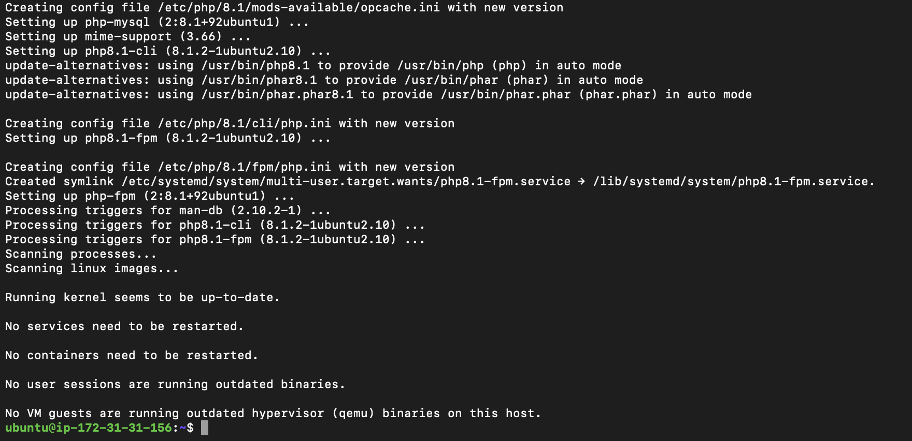

# PROJECT 2 - WEB STACK IMPLEMENTATION (LEMP STACK). The LEMP stack is a collection of Linux OS, Nginx Server, MySQL Database, and PHP.

## SIDE SELF STUDY:

<!-- Basic explanation of SQL syntax and most commonly used commands -->

## What is SQL?

SQL (Structured Query Language) is a programming language used for managing and manipulating relational databases. Here are some of the most commonly used SQL commands and syntax:

1. SELECT - used to retrieve data from a database. Syntax:
SELECT column_name(s) FROM table_name WHERE condition;

2. INSERT - used to insert new records into a table. Syntax:
INSERT INTO table_name (column1, column2, column3, ...) VALUES (value1, value2, value3, ...);  

3. UPDATE - used to update existing records in a table. Syntax:
UPDATE table_name SET column1 = value1, column2 = value2 WHERE condition; 

4. DELETE - used to delete records from a table. Syntax:
DELETE FROM table_name WHERE condition;   

5. CREATE - used to create a new table, index, or view. Syntax:
CREATE TABLE table_name (column1 datatype, column2 datatype, column3 datatype, ...);

6. ALTER - used to modify the structure of an existing table. Syntax:
ALTER TABLE table_name ADD column_name datatype; 

7. DROP - used to drop a table or database object. Syntax:
DROP TABLE table_name;   

8. JOIN - used to combine data from two or more tables. Syntax:
SELECT column_name(s) FROM table1 INNER JOIN table2 ON table1.column_name = table2.column_name; 

9. WHERE - used to filter data based on a specified condition. Syntax:
SELECT column_name(s) FROM table_name WHERE condition;    

10. ORDER BY - used to sort the result set in ascending or descending order
Syntax:
SELECT column_name(s) FROM table_name ORDER BY column_name ASC/DESC;

These are just a few examples of SQL syntax and commands. SQL has many other commands and features, depending on the database management system (DBMS) you are using. For more details and practice click [here](https://www.w3schools.com/sql/sql_syntax.asp)

<!-- WEB STACK IMPLEMENTATION (LEMP STACK) -->

<!-- Step 1 - Installing the Nginx web server -->

# Web stack (LEMP) implimentation in AWS.

## INTRODUCTION – WHAT IS LEMP?  

The LEMP software stack is a group of software that can be used to serve dynamic web pages and web applications written in PHP. This is an acronym that describes a Linux operating system, with an Nginx (pronounced like “Engine-X”) web server. The backend data is stored in the MySQL database and the dynamic processing is handled by PHP.

## STEP 1 – INSTALLING THE NGINX WEB SERVER

In order to display web pages to our site visitors, we are going to employ Nginx, a high-performance web server. We’ll use the apt package manager to install this package.

Since this is our first time using apt for this session, start off by updating your server’s package index. Following that, you can use apt install to get Nginx installed:

To update the package lists, run the following command: 
    
    sudo apt update

To upgrade the installed packages to their latest versions, run following command: 

    sudo apt upgrade

You can view the list of upgraded packages after running the `sudo apt upgrade` command by using the `apt list --upgradable` command. This command will show you a list of all packages that have updates available, including the ones that were upgraded during the most recent `apt upgrade` command.

To view the list of upgraded packages, open a terminal on your server and run the following command: 

    apt list --upgradable

This will display a list of all available upgrades, including the package name, the current installed version, and the version to which the package will be upgraded. The upgraded packages will be marked with the `[upgradable]` tag.

If you want to see only the list of packages that were upgraded during the most recent upgrade process, you can use the following command: 

    grep -i "upgrade" /var/log/dpkg.log

Server packages updated, see image below

To install Nginx, run the following command: 
    
    sudo apt install nginx

To verify that nginx was successfully installed and is running as a service in Ubuntu, run:

    sudo systemctl status nginx

Nginx successfully insatlled, see image below:    

Before we can receive any traffic by our Web Server, we need to open TCP port 80 which is default port that web browsers use to access web pages in the Internet.

As we know, we have TCP port 22 open by default on our EC2 machine to access it via SSH, so we need to add a rule to EC2 configuration to open inbound connection through port 80:

Our server is running and we can access it locally and from the Internet (Source 0.0.0.0/0 means ‘from any IP address’).

First, let us try to check how we can access it locally in our Ubuntu shell, run:

    curl http://localhost:80
  
or

    curl http://127.0.0.1:80 

Nginx responded with some payload, see image below:

These 2 commands above actually do pretty much the same – they use ‘curl’ command to request our Nginx on port 80 (actually you can even try to not specify any port – it will work anyway). The difference is that: in the first case we try to access our server via DNS name and in the second one – by IP address (in this case IP address 127.0.0.1 corresponds to DNS name ‘localhost’ and the process of converting a DNS name to IP address is called "resolution"). We will touch DNS in further lectures and projects.

As an output you can see some strangely formatted test, do not worry, we just made sure that our Nginx web service responds to ‘curl’ command with some payload.

Now it is time for us to test how our Nginx server can respond to requests from the Internet.
Open a web browser of your choice and try to access following url

    http://<Public-IP-Address>:80

Another way to retrieve your Public IP address, other than to check it in AWS Web console, is to use following command:

    curl -s http://169.254.169.254/latest/meta-data/public-ipv4

The URL in browser shall also work if you do not specify port number since all web browsers use port 80 by default.

If you see following page, then your web server is now correctly installed and accessible through your firewall.

page loaded succesfully, see image below:

In fact, it is the same content that you previously got by ‘curl’ command, but represented in nice HTML formatting by your web browser.

<!-- STEP 2 - Installing MYSQL -->

## STEP 2 — INSTALLING MYSQL

Now that you have a web server up and running, you need to install a Database Management System (DBMS) to be able to store and manage data for your site in a relational database. MySQL is a popular relational database management system used within PHP environments, so we will use it in our project.

Again, use ‘apt’ to acquire and install this software:

    sudo apt install mysql-server

When prompted, confirm installation by typing `Y`, and then `ENTER`.

MYSQL insatllation completed, see image below:

When the installation is finished, log in to the MySQL console by typing:  

    sudo mysql

This will connect to the MySQL server as the administrative database user root, which is inferred by the use of sudo when running this command. You should see output like this:

    Welcome to the MySQL monitor.  Commands end with ; or \g.
    Your MySQL connection id is 11
    Server version: 8.0.22-0ubuntu0.20.04.3 (Ubuntu)

    Copyright (c) 2000, 2020, Oracle and/or its affiliates. All rights reserved.

    Oracle is a registered trademark of Oracle Corporation and/or its
    affiliates. Other names may be trademarks of their respective
    owners.

    Type 'help;' or '\h' for help. Type '\c' to clear the current input statement.

    mysql> 

It’s recommended that you run a security script that comes pre-installed with MySQL. This script will remove some insecure default settings and lock down access to your database system. Before running the script you will set a password for the root user, using mysql_native_password as default authentication method. We’re defining this user’s password as `PassWord.1`

    ALTER USER 'root'@'localhost' IDENTIFIED WITH mysql_native_password BY 'PassWord.1';

Exit the MySQL shell with:

    mysql> exit

Start the interactive script by running:

    sudo mysql_secure_installation

This will ask if you want to configure the VALIDATE PASSWORD PLUGIN.

Note: Enabling this feature is something of a judgment call. If enabled, passwords which don’t match the specified criteria will be rejected by MySQL with an error. It is safe to leave validation disabled, but you should always use strong, unique passwords for database credentials.

Answer `Y` for yes, or anything else to continue without enabling.

    VALIDATE PASSWORD PLUGIN can be used to test passwords
    and improve security. It checks the strength of password
    and allows the users to set only those passwords which are
    secure enough. Would you like to setup VALIDATE PASSWORD plugin?

    Press y|Y for Yes, any other key for No:

If you answer “yes”, you’ll be asked to select a level of password validation. Keep in mind that if you enter `2` for the strongest level, you will receive errors when attempting to set any password which does not contain numbers, upper and lowercase letters, and special characters, or which is based on common dictionary words e.g `PassWord.1`

    There are three levels of password validation policy:

    LOW    Length >= 8
    MEDIUM Length >= 8, numeric, mixed case, and special characters
    STRONG Length >= 8, numeric, mixed case, special characters and dictionary              file

    Please enter 0 = LOW, 1 = MEDIUM and 2 = STRONG: 1

Regardless of whether you chose to set up the VALIDATE PASSWORD PLUGIN, your server will next ask you to select and confirm a password for the MySQL root user. This is not to be confused with the system root. The database root user is an administrative user with full privileges over the database system. Even though the default authentication method for the MySQL root user dispenses the use of a password, even when one is set, you should define a strong password here as an additional safety measure. We’ll talk about this in a moment.

If you enabled password validation, you’ll be shown the password strength for the root password you just entered and your server will ask if you want to continue with that password. If you are happy with your current password, enter `Y` for “yes” at the prompt:  

    Estimated strength of the password: 100 
    Do you wish to continue with the password provided?(Press y|Y for Yes, any other key for No) : y

For the rest of the questions, press `Y` and hit the `ENTER` key at each prompt. This will prompt you to change the root password, remove some anonymous users and the test database, disable remote root logins, and load these new rules so that MySQL immediately respects the changes you have made.

When you’re finished, test if you’re able to log in to the MySQL console by typing:

    sudo mysql -p

Notice the `-p` flag in this command, which will prompt you for the password used after changing the root user password.

To exit the MySQL console, type:  

    mysql> exit

Notice that you need to provide a password to connect as the root user.

For increased security, it’s best to have dedicated user accounts with less expansive privileges set up for every database, especially if you plan on having multiple databases hosted on your server.

    Note: At the time of this writing, the native MySQL PHP library mysqlnd doesn’t support caching_sha2_authentication, the default authentication method for MySQL 8. For that reason, when creating database users for PHP applications on MySQL 8, you’ll need to make sure they’re configured to use mysql_native_password instead. We’ll demonstrate how to do that in Step 6.

Your MySQL server is now installed and secured. Next, we will install PHP, the final component in the LEMP stack.    

<!-- STEP 3 – INSTALLING PHP -->

## STEP 3 – INSTALLING PHP

You have Nginx installed to serve your content and MySQL installed to store and manage your data. Now you can install PHP to process code and generate dynamic content for the web server.

While Apache embeds the PHP interpreter in each request, Nginx requires an external program to handle PHP processing and act as a bridge between the PHP interpreter itself and the web server. This allows for a better overall performance in most PHP-based websites, but it requires additional configuration. You’ll need to install `php-fpm`, which stands for “PHP fastCGI process manager”, and tell Nginx to pass PHP requests to this software for processing. Additionally, you’ll need `php-mysql`, a PHP module that allows PHP to communicate with MySQL-based databases. Core PHP packages will automatically be installed as dependencies.

To install these 2 packages at once, run:

    sudo apt install php-fpm php-mysql

When prompted, type `Y` and press `ENTER` to confirm installation.

installed successfully, see image below:

You now have your PHP components installed. Next, you will configure Nginx to use them. 

<!-- STEP 4 — CONFIGURING NGINX TO USE PHP PROCESSOR -->

## STEP 4 — CONFIGURING NGINX TO USE PHP PROCESSOR

When using the Nginx web server, we can create server blocks (similar to virtual hosts in Apache) to encapsulate configuration details and host more than one domain on a single server. In this guide, we will use projectLEMP as an example domain name.

On Ubuntu 20.04, Nginx has one server block enabled by default and is configured to serve documents out of a directory at `/var/www/html`. While this works well for a single site, it can become difficult to manage if you are hosting multiple sites. Instead of modifying `/var/www/html`, we’ll create a directory structure within `/var/www` for the `your_domain website`, leaving `/var/www/html` in place as the default directory to be served if a client request does not match any other sites.

Create the root web directory for your_domain as follows:

    sudo mkdir /var/www/projectLEMP

Next, assign ownership of the directory with the $USER environment variable, which will reference your current system user:

    sudo chown -R $USER:$USER /var/www/projectLEMP

Then, open a new configuration file in Nginx’s `sites-available` directory using your preferred command-line editor. Here, we’ll use `nano`: 

    sudo nano /etc/nginx/sites-available/projectLEMP

This will create a new blank file. Paste in the following bare-bones configuration:

    #/etc/nginx/sites-available/projectLEMP

    server {
        listen 80;
        server_name projectLEMP 52.38.140.208;
        root /var/www/projectLEMP;

        index index.html index.htm index.php;

        location / {
            try_files $uri $uri/ =404;
        }

        location ~ \.php$ {
            include snippets/fastcgi-php.conf;
            fastcgi_pass unix:/var/run/php/php8.1-fpm.sock;
         }

      location ~ /\.ht {
        deny all;
      }

    }

Here’s what each of these directives and location blocks do:

* `listen` — Defines what port Nginx will listen on. In this case, it will listen on port 80, the default port for HTTP.

* `root` — Defines the document root where the files served by this website are stored.

* `index` — Defines in which order Nginx will prioritize index files for this website. It is a common practice to list `index.html` files with a higher precedence than `index.php` files to allow for quickly setting up a maintenance landing page in PHP applications. You can adjust these settings to better suit your application needs.

* `server_name` — Defines which domain names and/or IP addresses this server block should respond for. **Point this directive to your server’s domain name or public IP address.**

* `location /` — The first location block includes a `try_files` directive, which checks for the existence of files or directories matching a URI request. If Nginx cannot find the appropriate resource, it will return a 404 error.

* `location ~ \.php$` — This location block handles the actual PHP processing by pointing Nginx to the fastcgi-php.conf configuration file and the `php7.4-fpm.sock file`, which declares what socket is associated with `php-fpm`.

* `location ~ /\.ht` — The last location block deals with `.htaccess` files, which Nginx does not process. By adding the deny all directive, if any `.htaccess` files happen to find their way into the document root ,they will not be served to visitors.

When you’re done editing, save and close the file. If you’re using `nano`, you can do so by typing `CTRL+X` and then `y` and `ENTER` to confirm.

Activate your configuration by linking to the config file from Nginx’s `sites-enabled` directory:

    sudo ln -s /etc/nginx/sites-available/projectLEMP /etc/nginx/sites-enabled/

This will tell Nginx to use the configuration next time it is reloaded. You can test your configuration for syntax errors by typing:

    sudo nginx -t

You shall see following message:

    nginx: the configuration file /etc/nginx/nginx.conf syntax is ok
    nginx: configuration file /etc/nginx/nginx.conf test is successful

If any errors are reported, go back to your configuration file to review its contents before continuing.

We also need to disable default Nginx host that is currently configured to listen on port 80, for this run:

    sudo unlink /etc/nginx/sites-enabled/default

When you are ready, reload Nginx to apply the changes:

    sudo systemctl reload nginx

Your new website is now active, but the web root /var/www/projectLEMP is still empty. Create an index.html file in that location so that we can test that your new server block works as expected:

    sudo echo 'Hello LEMP from hostname' $(curl -s http://169.254.169.254/latest/meta-data/public-hostname) 'with public IP' $(curl -s http://169.254.169.254/latest/meta-data/public-ipv4) > /var/www/projectLEMP/index.html

Now go to your browser and try to open your website URL using IP address:

    http://<Public-IP-Address>:80

If you see the text from ‘echo’ command you wrote to index.html file, then it means your Nginx site is working as expected.
In the output you will see your server’s public hostname (DNS name) and public IP address. You can also access your website in your browser by public DNS name, not only by IP – try it out, the result must be the same (port is optional)

    http://<Public-DNS-Name>:80

web page succefully loaded, see image below:

You can leave this file in place as a temporary landing page for your application until you set up an `index.php` file to replace it. Once you do that, remember to remove or rename the `index.html` file from your document root, as it would take precedence over an `index.php` file by default.

Your LEMP stack is now fully configured. In the next step, we’ll create a PHP script to test that Nginx is in fact able to handle `.php` files within your newly configured website. 

<!-- STEP 5 – TESTING PHP WITH NGINX -->

## STEP 5 – TESTING PHP WITH NGINX

Your LEMP stack should now be completely set up.

At this point, your LEMP stack is completely installed and fully operational.

You can test it to validate that Nginx can correctly hand `.php` files off to your PHP processor.

You can do this by creating a test PHP file in your document root. Open a new file called `info.php` within your document root in your text editor:

    sudo nano /var/www/projectLEMP/info.php

Type or paste the following lines into the new file. This is valid PHP code that will return information about your server:

    <?php
    phpinfo();

You can now access this page in your web browser by visiting the domain name or public IP address you’ve set up in your Nginx configuration file, followed by `/info.php`:

    http://`server_domain_or_IP`/info.php

You will see a web page containing detailed information about your server:

PHP with Nginx page loaded successfully, see image below

After checking the relevant information about your PHP server through that page, it’s best to remove the file you created as it contains sensitive information about your PHP environment and your Ubuntu server. You can use `rm` to remove that file:

    sudo rm /var/www/your_domain/info.php

You can always regenerate this file if you need it later.

<!-- STEP 6 – RETRIEVING DATA FROM MYSQL DATABASE WITH PHP (CONTINUED) -->

## STEP 6 – RETRIEVING DATA FROM MYSQL DATABASE WITH PHP (CONTINUED)

In this step you will create a test database (DB) with simple "To do list" and configure access to it, so the Nginx website would be able to query data from the DB and display it.

At the time of this writing, the native MySQL PHP library `mysqlnd` doesn’t support `caching_sha2_authentication`, the default authentication method for MySQL 8. We’ll need to create a new user with the `mysql_native_password` authentication method in order to be able to connect to the MySQL database from PHP.

We will create a database named **example_database** and a user named **example_user**, but you can replace these names with different values.

First, connect to the MySQL console using the **root** account:

    sudo mysql

To create a new database, run the following command from your MySQL console:

    mysql> CREATE DATABASE `example_database`;

Now you can create a new user and grant him full privileges on the database you have just created.

The following command creates a new user named `example_user`, using mysql_native_password as default authentication method. We’re defining this user’s password as `password`, but you should replace this value with a secure password of your own choosing.

    mysql>  CREATE USER 'example_user'@'%' IDENTIFIED WITH mysql_native_password BY 'password';

Now we need to give this user permission over the example_database database:

    mysql> GRANT ALL ON example_database.* TO 'example_user'@'%';

This will give the `example_user` user full privileges over the `example_database` database, while preventing this user from creating or modifying other databases on your server.

Now exit the MySQL shell with:

    mysql> exit

You can test if the new user has the proper permissions by logging in to the MySQL console again, this time using the custom user credentials:

    mysql -u example_user -p

Notice the `-p` flag in this command, which will prompt you for the password used when creating the `example_user` user. After logging in to the MySQL console, confirm that you have access to the `example_database` database:  

    mysql> SHOW DATABASES;

This will give you the following output:

    Output
    +--------------------+
    | Database           |
    +--------------------+
    | example_database   |
    | information_schema |
    +--------------------+
    2 rows in set (0.000 sec)

Next, we’ll create a test table named todo_list. From the MySQL console, run the following statement:

    CREATE TABLE example_database.todo_list (
      item_id INT AUTO_INCREMENT,
      content VARCHAR(255),
      PRIMARY KEY(item_id)
    );

Insert a few rows of content in the test table. You might want to repeat the next command a few times, using different VALUES:

    mysql> INSERT INTO example_database.todo_list (content) VALUES ('My first important item');

To confirm that the data was successfully saved to your table, run:

    mysql>  SELECT * FROM example_database.todo_list;

This is my  output below:

After confirming that you have valid data in your test table, you can exit the MySQL console:

    mysql> exit

Now you can create a PHP script that will connect to MySQL and query for your content. Create a new PHP file in your custom web root directory using your preferred editor. We’ll use vi for that:

    nano /var/www/projectLEMP/todo_list.php

The following PHP script connects to the MySQL database and queries for the content of the todo_list table, displays the results in a list. If there is a problem with the database connection, it will throw an exception.

Copy this content into your todo_list.php script, change the username and password in the script below to match with yours if you used something different:

    <?php
    $user = "example_user";
    $password = "password";
    $database = "example_database";
    $table = "todo_list";

    try {
      $db = new PDO("mysql:host=localhost;dbname=$database", $user, $password);
      echo "<h2>TODO</h2><ol>";
      foreach($db->query("SELECT content FROM $table") as $row) {
        echo "<li>" . $row['content'] . "</li>";
      }
      echo "</ol>";
    } catch (PDOException $e) {
        print "Error!: " . $e->getMessage() . " ";
        die();
    }

Save and close the file when you are done editing.

You can now access this page in your web browser by visiting the domain name or public IP address configured for your website, followed by /todo_list.php:

    http://<Public_domain_or_IP>/todo_list.php

You should see a page like this, showing the content you’ve inserted in your test table. My page loaded succesfully, see image below:

