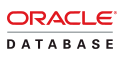

# PROJECT 3: SIMPLE TO-DO APPLICATION ON MERN WEB STACK

# Self Study Before Taking on Project 3

## What is MERN stack?

Check source [here](https://www.simplilearn.com/tutorials/mongodb-tutorial/what-is-mern-stack-introduction-and-examples#:~:text=MERN%20stack%20is%20a%20collection,stack%20are%20all%20JS%2Dbased.)

MERN stack is a collection of technologies that enables faster application development. It is used by developers worldwide. The main purpose of using MERN stack is to develop apps using JavaScript only. This is because the four technologies that make up the technology stack are all JS-based. Thus, if one knows JavaScript (and JSON), the backend, frontend, and database can be operated easily. 

## MERN Stack Full Form

MERN Stack is a compilation of four different technologies (MongoDB, Express, React / Redux, and Node.js) that work together to develop dynamic web apps and websites. 

It is a contraction for four different technologies as mentioned below:

1. Database  
**MongoDB** is a NoSQL DBMS where data is stored in the form of documents having key-value pairs similar to JSON objects. MongoDB enables users to create databases, schemas, and tables. It offers the Mongo shell that provides a JS interface for deleting, querying, and updating the records.

2. Backend Framework  
**ExpressJS** is a NodeJS framework that simplifies writing the backend code. It saves you from creating multiple Node modules. For keeping the code precise, ExpressJS offers a range of middleware.

3. Frontend Library  
**ReactJS** is a javascript library that allows the development of user interfaces for mobile apps and SPAs (Single Page Applications). It allows you to code JavaScript and develop UI components. The JS library uses virtual DOM for doing everything.

4. Runtime Environment  
**NodeJS** is an open-source JavaScript runtime environment that allows users to run code on the server. It comes with the node package manager or npm, enabling users to select from a wide selection of node modules or packages. Being developed on the Chrome JavaScript Engine enables Node to execute code faster.

## Why Should You Work With MERN Stack?

There are many good reasons to use the MERN Stack. For example, it allows the creation of a 3-tier architecture that includes frontend, backend, and database using JavaScript and JSON.

MongoDB, which is the base of the MERN stack, is designed to store JSON data natively. Everything in it, including CLI and query language, is built using JSON and JS. The NoSQL database management system works well with NodeJS and thus, allows manipulating, representing, and storing JSON data at every tier of the application.

It comes in a variant called MongoDB Atlas that further eases database management by offering an auto-scaling MongoDB cluster on any cloud provider and with just a few clicks.

Express is a server-side framework that wraps HTTP requests and responses and makes mapping URLs to server-side functions easy. This perfectly complements the ReactJS framework, a front-end JS framework for developing interactive UIs in HTML while communicating with the server.

As the two technologies work with JSON, data flows seamlessly, making it possible to develop fast and debug easily. To make sense of the entire system, you need to understand only one language, i.e., JavaScript and the JSON document structure.

## Use Cases of MERN

Like other popular web stacks, it is possible to develop whatever you want in MERN. Nonetheless, it is ideal for cloud-based projects where you require intensive JSON and dynamic web interfaces. A few examples of purposes where MERN is used are:

**Calendars and To-do Apps**  
A calendar or a to-do app is a rudimentary project that can tell you a lot about the mechanics of the MERN stack. You can design the frontend, i.e., the interface of the calendar or to-do app using ReactJS. The data to be stored, accessed, modified, shown in the to-do app is made possible using MongoDB.

**Interactive Forums**  
Another suitable use case for MERN is an interactive forum, which can be a social media platform or a website that allows users to share messages and communicate. The topic of the interactive forum may or may not be predefined.

**Social Media Product**  
An interactive forum is just one use of the MERN stack for social media. These include ads, posts, a mini web app embedded in the social media page, etc.

---
## Database Management Systems (DBMS)

Check source [here](https://www.techopedia.com/definition/24361/database-management-systems-dbms)

**What is a DBMS?**  
A database management system (DBMS) is middleware that allows programmers, database administrators (DBAs), software applications and end users to store, organize, access, query and manipulate data in a database. 

DBMSs are important because they provide efficient and reliable mechanisms for organizing, managing and using vast amounts of data while also ensuring data integrity and providing other data management benefits. 

In the enterprise, database management systems provide database administrators (DBAs) with a structured framework that facilitates data sharing among different departments, teams and applications. The DBMS provides employees with controlled and organized access to data that they can use to drive innovation and help their company maintain a competitive edge.

**Database vs DBMS**  
The terms “database” and “database management system” are often used interchangeably in casual conversations. That’s probably because when end users interact with a database, they are not aware of the underlying DBMS and its distinct role in managing data. To add to the confusion, in some cases the DBMS is embedded directly into application code. This makes it even less apparent that a separate system is involved.

To differentiate between the two terms and use them correctly, it’s helpful to understand their respective roles and functionalities: A database is a structured collection of data. The database management system is the software that developers, end users and applications use to interact with a database.

## Types of Database Management Systems

Until the turn of the century, database management systems were classified as either being relational or non-relational, depending on their structure and uses. If the DBMS stored data in tables, it was referred to as a relational DBMS (RDBMS). If it did not store data in tables, it was referred to as a NoSQL or non-relational DBMS.

Today, database management systems are still categorized as being either RDBMS or non-RDBMS, but they are also classified by the unique advantages they provide. Types of DBMSs include:

**Cloud Database Management Systems** – Cloud DBMSs like Amazon Aurora are designed to manage distributed data stored in a cloud provider’s remote data centers. 

**Columnar Database Management Systems** – Columnar DBMSs like Apache Cassandra return queries faster by storing data in columns instead of rows. This schema makes it easier for data analytics and business intelligence applications to work with large datasets.

**Distributed Database Management Systems** – DDBMS functionalities like those found in the Apache Hadoop ecosystem are designed to ensure data integrity for logically-related databases across multiple locations or computing environments. 

**Graph Database Management Systems** – These systems are designed to support graph databases that store relationships at the individual record level. Graph DBMSs like Neo4j are ideal for managing data with interconnected relationships, such as social media data. 

**Hierarchical Database Management Systems** – Hierarchical management systems are designed to support databases organized in parent-child relationships. This type of DBMS has its roots in mainframe computing and its uses today are limited. 

**HTAP Database Management Systems** – Hybrid transaction/analytical processing DBMSs are designed to support mixed workloads for transactional and analytical data. Traditional database systems often have separate systems for online transaction processing (OLTP) and online analytical processing (OLAP) workloads. HTAP management systems like SAP HANA and CockroachDB provide a unified platform that can handle both types of tasks concurrently.

**In-memory Database Management Systems** – In-memory management systems are designed to reduce latency by using main memory for data management and storage. Volt Active Data and other IMDBMSs make data retrieval significantly faster and improve overall system performance.

**Object-oriented database management system** (OODBMS) – db4o is one example of this type of DBMS. OODMBSs are designed to manage complex data structures as storage objects. 

**NewSQL Database Management Systems** — NewSQL DBMSs like PostgreSQL provide the scalability and performance benefits of NoSQL databases while retaining the ACID properties of traditional relational databases. This type of DBMS is designed for large-scale distributed environments and can handle high-throughput transactional workloads.

**Time-Series Database Management Systems** — Time-series DBMSs like InfluxDB optimize the storage, retrieval and analysis of time-stamped data. They are often used to support financial analytics and Internet of Things (IoT) monitoring systems.

## Well-Known Database Management Systems
Examples of well-known DBMSes include: 

&nbsp;  

  
**ACCESS** – a lightweight relational database management system (RDMS) included in Microsoft Office and Office 365.

&nbsp;

  
**Amazon RDS** – a native cloud DBMS that offers engines for managing MySQL, Oracle, SQL Server, PostgreSQL and Amazon Aurora databases.

&nbsp;

  
Apache Cassandra – an open-source distributed database management system known for being able to handle massive amounts of data.

&nbsp;

  
**Filemaker** – a low-code/no-code (LCNC) relational DBMS.

&nbsp;

  
**Google Cloud Spanner** — a globally distributed, horizontally scalable, and strongly consistent relational database service offered by Google Cloud.

&nbsp;

  
**IBM Db2** — a family of relational database management systems developed by IBM that offers various editions for different environments and workloads.

&nbsp;

  
**MariaDB** – an open-source relational database fork of MySQL.

&nbsp;

  
**Microsoft Azure SQL Database** — a cloud-based relational database service provided by Microsoft Azure that offers fully-managed SQL databases.

&nbsp;

  
**MongoDB** — A popular NoSQL database management system that uses a document-oriented schema to provide high scalability and flexibility.

&nbsp;

  
**MySQL** – an open-source relational database management system (RDBMS) owned by Oracle.

&nbsp;

  
**Oracle** – a proprietary RDMS optimized for hybrid cloud architectures.

&nbsp;

  
**PostgreSQL** — an open-source relational database management system known for its robustness, scalability and extensive feature sets.

&nbsp;

  
**SAP HANA** — an in-memory, column-oriented RDBMS optimized for real-time data ingestion and high-performance analytics. 

&nbsp;

  
**SQL Server** – an enterprise-level relational database management system from Microsoft that is capable of handling extremely large volumes of data and database queries.

&nbsp;

  
**SQLite** — a lightweight, file-based relational database engine that is widely used in embedded systems and mobile applications.

&nbsp;

  
**Teradata** – a powerful SQL engine that provides scalable solutions for managing and analyzing large volumes of data.
